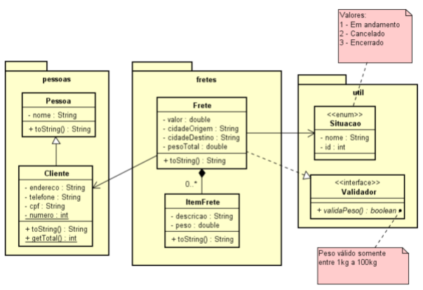

# PrimeiroTrabalho



- [x] Cliente é uma Pessoa 
- [x] Frete tem vários itens (no mínimo 0) que são armazenados em uma TreeSet
- [x] Um Frete tem um Cliente
- [ ] O Frete tem situação, mapeada usando enum
- [ ] O peso do Frete deve ser validado usando a interface Validador, para calcular o
   peso total é necessário somar o peso de cada item do frete
- [x] A classe Pessoa é abstrata
- [x] A classe ItemFrete é final
- [x] O número do Cliente deve ser declarado como variável de classe e determinar o
   número total de clientes cadastrados
- [x] O método getTotal() retorna o número de clientes criados, use para isso a
   variável de classe definida na classe Cliente
- [ ] Faça as modificações necessárias na classe Frete para que seus objetos possam
    ser armazenados em um conjunto ordenado. Use o valor do frete para a ordenação
    dos objetos Tema Frete

- [x] Crie o menu abaixo:
    ```
    1 – Cadastrar Frete
    2 – Pesquisar Frete usando o nome do cliente
    3 – Pesquisar Frete usando CPF do Cliente
    4 – Pesquisar Frete usando cidade de origem e destino
    5 – Listar todos os Fretes
    6 – Listar todos os Clientes cadastrados
    7 – Sair 
    ```
# Observações:
* [x] Para fazer o item 6 do menu você deve percorrer os fretes e mostrar os clientes
    vinculados a cada frete.

* [x] Para montar o menu você deve usar uma enumeração, como abordado em aula.

* [ ] Enviar projeto elaborado no Eclipse ou compatível, contendo os arquivos fonte do
    projeto (.java).
